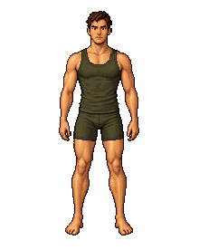
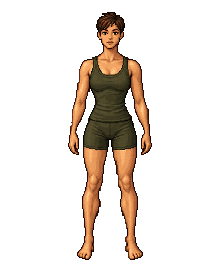

# UltimaRobe

**Your real wardrobe, as an RPG inventory.**

UltimaRobe turns clothing photos into a pixel-art wardrobe: drag a shirt, trousers, or shoes onto your character, build an outfit, and optionally generate a realistic preview with local AI.

This is **UltimaRobe 0.2 beta**, built on [Anyesh/Wardrowbe](https://github.com/Anyesh/wardrowbe). The core wardrobe has an automated clean-install integration suite. It is a standalone source derivative, not an official Wardrowbe release. Inspired by classic RPG inventory screens; not affiliated with Ultima, Baldur's Gate, or their publishers.

 

## What is included

- Pixel mannequin, photo view, SVG sketch, and optional realistic preview.
- One item per equipment slot; drag-and-drop or click to equip.
- Small, medium, and large inventory tiles with hover information.
- Masculine and feminine default sprites, plus upload your own likeness.
- Per-garment regeneration and placement controls, including cut and sleeve details.
- Optional fantasy item names, lore, and attribute bonuses.
- Saved outfits, comparison boards, outfit suggestions, and two visual themes.
- Height, weight, build, and optional measurements for realistic image prompts.

Your photos and generated sprites belong in your own installation. No personal wardrobe or avatar is included here. The two bundled default sprites were AI-generated for this project. Model weights are downloaded separately and have their own terms.

## Run it

Prerequisites: Docker with Compose, an OIDC identity provider, and Python 3 to create configuration. Linux containers are required; Windows users can use Docker Desktop with WSL2.

1. Clone this repository and run `python scripts/configure.py`. This creates a private `.env` with random secrets and refuses to overwrite an existing file.
2. Edit `.env`: set your public app URL and OIDC issuer, client ID, and client secret. Register `<APP_URL>/api/auth/callback/oidc` as the OIDC redirect URI. The issuer must be reachable by both the browser and containers and supply email/profile claims.
3. Run `python scripts/start.py`. It checks configuration and OIDC discovery, builds the containers, and waits for service readiness. To inspect configuration without starting, use `python scripts/doctor.py --network`.
4. Open your app URL, sign in, upload clothes, and visit `/dashboard/inventory`.

The web port binds to **127.0.0.1:3000**. Use a TLS reverse proxy for access from other machines. The database, sprite API, renderer, and workers are not published on host ports. Production login is required; development authentication is disabled.

The core stack is tested with fresh databases, signed OIDC test identities, clothing uploads, saved outfits, real sprite jobs, account isolation, and container recreation. Setup still requires an OIDC provider: this beta is aimed at self-hosters comfortable with Docker. Browser login against your chosen identity provider and GPU rendering remain environment-specific checks. See [validation details](docs/VALIDATION.md).

## Local AI

The sprite engine works with metadata and image-processing fallbacks without an LLM. Set `VISION_MODEL` to an installed Ollama vision model and `OLLAMA_HOST` to its endpoint for richer analysis. `AI_INTERNAL_ENABLED=true`, `AI_BASE_URL`, `AI_VISION_MODEL`, and `AI_TEXT_MODEL` separately enable Wardrowbe's tagging workers. No model is silently selected or installed for you.

Realistic rendering is optional and experimental: `python scripts/start.py --realistic`. It requires NVIDIA container GPU support and at least **18 GB of free VRAM** under the current conservative memory check. The first render downloads SDXL weights into the model-cache volume. A 32 GB GPU was used during development. The interface detects when the renderer is unavailable and disables generation. Images are estimates, not measurements of actual garment fit. Cut, pose, texture, and likeness can still drift.

Sprite background removal can download U2Net weights on first use. Outbound downloads may therefore be needed even with local inference. The CPU segmentation fallback is available if the model cannot load.

## Development and data

See [development and operations](docs/DEVELOPMENT.md), [credits](NOTICE.md), and the [release notes](CHANGELOG.md). Keep named Docker volumes when upgrading; they contain your database, clothes, avatar choices, sprites, and renders. Back up both PostgreSQL and the data volumes before upgrades. Some display preferences and comparison pins live in browser storage.

Code is provided under the [MIT license](LICENSE), retaining the upstream copyright notice. Dependencies and AI models retain their own licenses.
